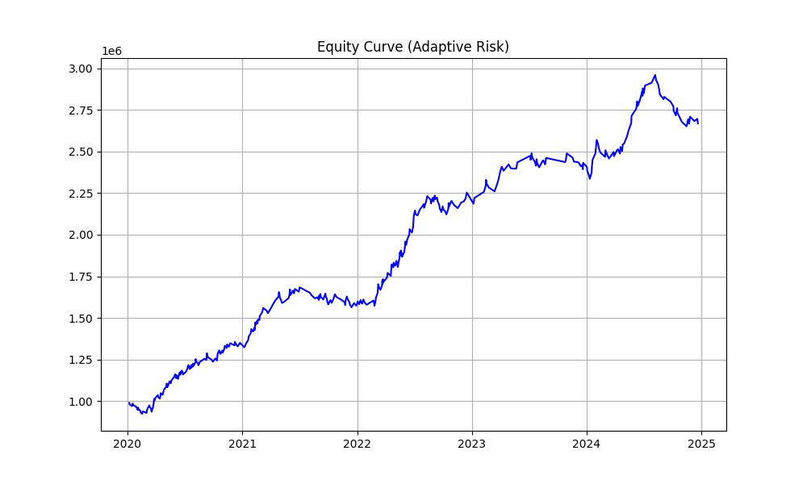
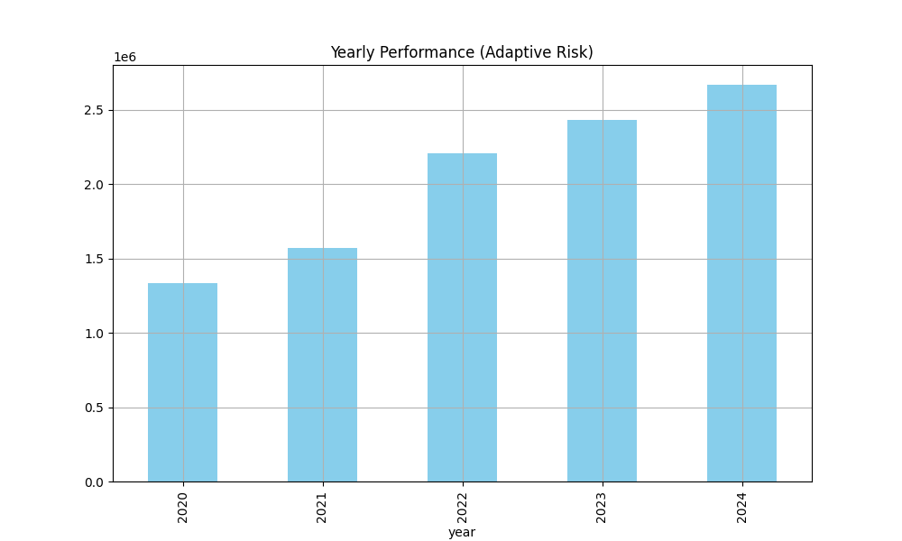
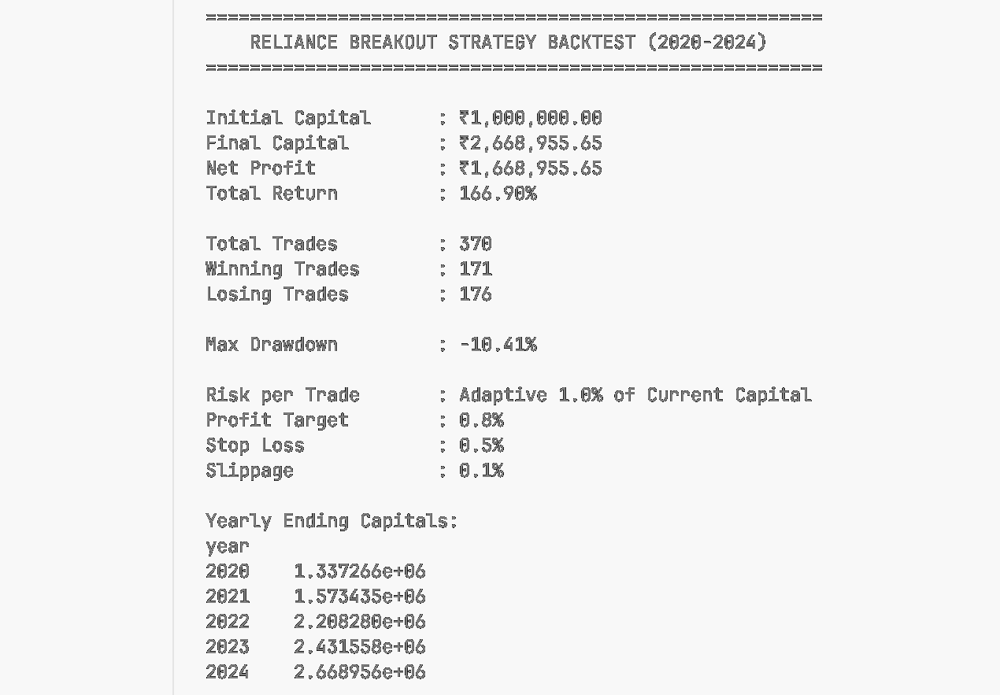

# 📊 Breakout Strategy Backtest (2020-2024)

This repository contains a Python implementation of an **intraday breakout trading strategy** for Reliance Industries Limited based on minute-level data. The strategy executes trades based on breakout levels within the first hour of trading and includes risk management features like adaptive position sizing, profit targets, stop-losses, and slippage.

---

## 📈 Strategy Overview

- **Data Range:** 2020-01-01 to 2024-12-31  
- **Asset:** Reliance Industries Limited (minute-level data)
- **Initial Capital:** ₹1,000,000  
- **Risk Per Trade:** Adaptive (1% of current capital)  
- **Profit Target:** 0.8%  
- **Stop Loss:** 0.5%  
- **Slippage:** 0.1%  

---

## 📊 Methodology

1. Load and filter minute-level Reliance data from 2020-2024.
2. For each trading day:
   - Capture the **opening price**.
   - Calculate an **upper breakout threshold** (opening price × 1.008).
   - Identify breakouts within **09:15 - 10:15 AM**.
   - If a breakout occurs:
     - Enter a long trade with calculated quantity based on risk per trade.
     - Set target and stop-loss prices.
     - Exit at **target hit**, **stop-loss hit**, or **end of day**.
3. Track capital, trade details, and equity curve.
4. Compute performance metrics like total return, max drawdown, yearly ending capital, total trades, wins, and losses.
5. Generate visualizations for equity curve and yearly performance.

---

## 📊 Results

**Key Metrics (Example Dashboard Output)**

- Initial Capital : ₹1,000,000.00  
- Final Capital : ₹X,XXX,XXX.XX  
- Net Profit : ₹XXX,XXX.XX  
- Total Return : XX.XX%

- Total Trades : XXX  
- Winning Trades : XXX  
- Losing Trades : XXX

- Max Drawdown : XX.XX%

- Risk per Trade : Adaptive 1.0% of Current Capital  
- Profit Target : 0.8%  
- Stop Loss : 0.5%  
- Slippage : 0.1%

---

## 📊 Visualizations

**Figure 1:** Equity Curve over the entire backtest period  


**Figure 2:** Yearly Performance (Ending Capital for each year)  


**Figure 3:** 


---

## 🛠️ How to Run

1. Install requirements  
   ```bash
   pip install pandas matplotlib

2. Update your file path in the main() function :
  file_path = "path/to/STOCK_minute.csv"

3. Run the script : 
  python breakout_backtest.py
